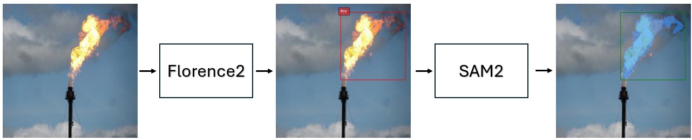

# Florence2 + SAM 2: Fire and Smoke Detection in CCTV images and videos

This repository is build up using SAM2 model from Meta AI Research and Florence2 model from Microsoft Research. The main goal of this project is to detect fire and smoke in CCTV images and videos in real time.

|                                                             
|------------------------------------------------------------------------------------------------|
| <p align="center"> <b>Figure 1: Florence2 and SAM2 pipeline for fire and smoke detection</b> . |


## Getting started
```
git clone https://github.com/jaswindersingh2/fire-and-smoke-detectors.git
cd fire-and-smoke-detectors
```

### Create Conda Virtual Environment and Install Dependencies

For Linux
```
conda env create -f environmentLinux.yml
```

Activate the conda environment
```
conda activate sam2
```

Also install SAM2
```
pip install -e .
```

### Download Checkpoints

To SAM2.1 checkpoints

```bash
cd checkpoints && \
./download_ckpts.sh && \
cd ..
```

### Run Inference notebook

Local computer running the notebook:

```
jupyter notebook
```

Server computer running the notebook:

```
jupyter notebook --no-browser --ip=0.0.0.0
```

Then open the notebook [inference.ipynb](inference.ipynb) and run the cells to get florence2 + SAM2 pipeline output.